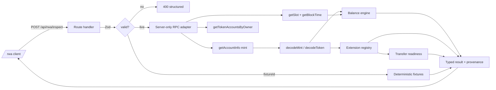

# RWA Lens

**Know what your real-world token means.** Paste a Solana mint and get a straight
answer to three questions a wallet will not answer for you: *what is this token,
what does a holder's balance actually mean right now, and what can the issuer do
to it?*

Read-only. RWA Lens never signs, sends, mints, burns, freezes or transfers
anything, and there is no signer anywhere in the codebase.

- Live app: `/rwa`
- Source: https://github.com/operatoruplift/rwa-lens
- Limitations and boundaries: [docs/rwa-limitations.md](docs/rwa-limitations.md)
- Reproducible evidence: [docs/rwa-demo-evidence.md](docs/rwa-demo-evidence.md)

## The problem

Tokenized treasuries, funds, private credit and commodities on Solana are
**Token-2022** mints, and Token-2022 extensions silently change what a token
*is*:

| Extension | What it means to whoever holds the token |
| --- | --- |
| `ScaledUiAmountConfig` | The balance is raw units × an issuer-controlled multiplier. **Yield arrives by changing the multiplier, not by a transfer** — so the number moves with no transaction in your history. |
| `PermanentDelegate` | An address can move or burn your tokens **without your signature**, and you cannot revoke it. |
| `TransferHook` | A program runs on every transfer and can reject it. This is the KYC gate. |
| `DefaultAccountState` | New accounts arrive **frozen** until an authority thaws them. |
| `TransferFeeConfig` | A cut is withheld on every transfer. |
| `PausableConfig` | An authority can pause all transfers. |
| Confidential transfer | Part of the balance is encrypted, and therefore **unknown — not zero**. |

A holder looking at their wallet sees a number. They do not see that the issuer
holds clawback authority over it. RWA Lens shows both, names the authority
addresses, and cites the slot it read them at.

## Why this has to be on Solana

Token-2022 extensions are a Solana mechanism. The product cannot exist anywhere
else — there is no chain-agnostic version of this question. Everything shown is
decoded from the mint and token accounts with the official
`@solana-program/token-2022` decoders; no byte offsets are hand-written.

## Accounting: the part most tools get wrong

Token-2022 stores **raw base units**. `ScaledUiAmount` changes only the display
conversion. RWA Lens therefore:

1. sums raw integer amounts across every token account **first**, as `BigInt`;
2. converts **once**, at the end;
3. computes the standard decimal amount exactly (`raw ÷ 10^decimals`, no float);
4. computes the scaled amount with the **official** Token-2022 helper and labels
   it `official-helper`, because that helper multiplies through a JS `number`
   and cannot be called exact;
5. selects the active multiplier using the **observed chain block time**, so a
   scheduled change is evaluated against chain state, not the server clock. If
   block time is unavailable, `timeSource` becomes `local-estimate` and the UI
   shows an amber warning rather than pretending.

No u64, supply, multiplier or balance is ever parsed into a JS `number` for
accounting.

## Transfer readiness is an explanation, not a permission

The verdict is `ready`, `attention`, `blocked` or `unknown`, and **an unknown is
never softened into a ready**. Every reason names the specific extension,
authority address or account state it came from. RWA Lens makes no claim about
KYC, AML, accreditation, sanctions, securities law, proof of reserves or
redemption rights.

## Run it

Node 22.19+ and npm.

```sh
npm ci
npm run dev          # http://127.0.0.1:3000/rwa
```

It works immediately with no configuration: three deterministic fixtures cover a
tokenized treasury with a scheduled multiplier, a private-credit receipt behind a
transfer hook with a confidential portion, and a plain SPL mint.

For live reads, copy `.env.example` to `.env.local` and set a server-side RPC URL:

```sh
RWA_CLUSTER=mainnet-beta
RWA_RPC_URL=https://your-provider.example/…
```

A browser can never supply a cluster or an RPC URL. A cluster the operator has
not configured returns a structured `not-configured` state rather than silently
falling back to a different one.

## Checks

```sh
npm run lint
npm run typecheck
npm test             # 56 unit tests
npm run build
npm run test:e2e     # 11 browser tests, fixture-only, no RPC needed
```

## Architecture



Fixture mode and live mode return the **same typed contract**, so the UI has one
code path and the demo cannot drift from the real thing.

## Security

Zod at every boundary; no secrets in the client bundle; no arbitrary RPC, URL or
redirect from user input; per-instance rate limiting; bounded timeouts, retries
and account caps; metadata fetching deny-by-default with SSRF protections;
structured errors that never leak a provider URL or a stack. Details and the
honest limits of each control are in
[docs/rwa-limitations.md](docs/rwa-limitations.md).

## Status

Read-only inspection is complete and verified against mainnet. Saved reports,
the issuer-registry adapter and the NAV adapter are **defined but disabled**; no
issuer endpoint is hard-coded and no USD value is ever fabricated. See the
evidence document for exactly which integrations are verified versus deferred.

## Licence

MIT.
