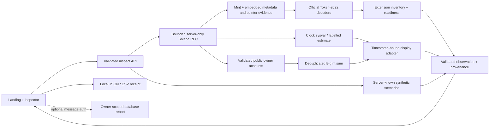

# RWA Lens

> **In 20 seconds.** RWA Lens reads a Solana Token-2022 mint with the official decoders, reconciles raw and displayed balances (ScaledUiAmount, fees, frozen state), and lists who can transfer, freeze, or burn. Try it: [rwalensonsolana.vercel.app/rwa](https://rwalensonsolana.vercel.app/rwa) with Ondo USDY as the live example. Built by Matt ([RVAClassic](https://x.com/operatoruplift), Operator Uplift) for the Solana Foundation **Tokenized Real-World Assets** sprint, September 2026. Real today: live mainnet reads, JSON/CSV receipts, installable PWA, Seeker Android shell, wallet sign-in through Mobile Wallet Adapter. Cloud report storage is a deployment-configured capability: a deployment that supplies its own database, session secret and exact origin serves owner-scoped saved reports, and the public deployment serves the guest path, where inspection and receipts need no account. Everything below is verification detail; nothing claims traction or audits that have not happened.

**Real assets. Clearer vision.** RWA Lens helps wallet builders, issuers,
fund administrators, custodians and treasury operators inspect a Solana mint,
reconcile public raw balances with displayed amounts, and understand observable
transfer controls.

[Open the app](https://rwalensonsolana.vercel.app) ·
[Inspector](https://rwalensonsolana.vercel.app/rwa) ·
[Brand kit](https://rwalensonsolana.vercel.app/brand-kit) ·
[Verification evidence](docs/rwa-demo-evidence.md) ·
[Capability matrix](docs/rwa-capability-matrix.md) ·
[Two-minute demo](docs/rwa-demo-script.md)

**Read-only by design.** The app reads public chain state and guarantees it
never signs or submits transactions, moves assets, mints, settles, lends or takes
custody. Optional wallet **message** signing authenticates saved-report
ownership only. Saving a report is a database write; guest inspection and
JSON/CSV export require no wallet.

## Visual identity

The home page pairs original optical artwork with gentle scroll depth, section
reveals and a sticky optical illustration. Wheel, touch, keyboard and fragment
navigation retain native browser scrolling. `/rwa` opens a compact version for
direct inspection; both routes retain the same public inspector. Motion responds
to changes in the system's reduced-motion setting, and marketing content remains
readable without JavaScript. The inspector stays outside the animated reveals.

The [brand kit](https://rwalensonsolana.vercel.app/brand-kit) includes an optical
mark, wordmarks, profile images, three campaign posts, portrait/story layouts,
headers, link previews, and desktop/mobile wallpapers. Each composition is
available as an editable SVG; campaign images also ship as PNGs. The gallery
uses smaller WebP previews. Download the complete ZIP or individual assets.

After `npm ci`, install the renderer with `npx playwright install chromium`.
The generator requires `/usr/bin/zip` on macOS/Linux; `PW_EXE` can point to an
existing Chromium executable. Run `node scripts/build-brand-kit.mjs` to rebuild exports and the ZIP from the
checked-in artwork and embedded Inter font. See the
[brand guide](public/brand-kit/brand-guide.md) for dimensions, crop guidance and
source resolution, and [attribution](docs/third-party-notices.md) for MotionSites
design references and the original artwork provenance.

## What makes it useful

A wallet balance alone does not explain a token's authorities, extension controls
or display conversion. RWA Lens puts raw units, decimals, the current display
multiplier, account states and source evidence together. Its Solana contribution
is Token-2022-aware accounting using the official decoders. Plain SPL Token is
also supported; neither program ownership nor metadata proves an asset is an RWA.

The curated live example is **Ondo USDY**, an officially attributed non-stock
Treasury-linked note on Solana. The checked-in [source manifest](lib/rwa/live-assets.json)
records the exact mint, network, issuer sources and retrieval date. USDY's observed
mint uses **legacy SPL Token**. A clearly labelled synthetic treasury receipt
separately demonstrates Token-2022 scheduled display multipliers. Issuer descriptions
are attribution, not independent verification of backing or legal rights.

## Accounting and controls

Raw amounts and supply stay as decimal strings / `BigInt`. Public accounts are
validated for program, mint and owner and deduplicated before summing. The
standard decimal amount is exact. The official Scaled UI Amount conversion is
an isolated floating-point display calculation, labelled `official-helper`;
its output is never fed back into raw accounting.

The active multiplier is selected using the observed Clock sysvar timestamp.
The mint, Clock and owner reads expose their own context slots. They are separate
reads, not an atomic snapshot. Block time or local-clock fallback is explicitly
an estimate; incomplete accounts and unsupported data remain partial or unknown.

| Extension | Explanation |
| --- | --- |
| Scaled UI Amount | Changes display conversion without changing raw units; scheduled boundaries and rounding are shown. |
| Interest Bearing | Decoded and reported: current rate, pre-update rate and the rate authority, shown next to the exact standard decimal amount. Accrued display value sits outside this release's conversion scope, and Token-2022 treats the extension as incompatible with Scaled UI Amount. |
| Transfer Hook | Names the hook program and its update authority, and keeps transfer success an open question rather than executing that program. When the extension carries no hook program, it says so plainly: no extra program runs on transfer today, and it names the authority able to set one later. A hook address is not a KYC credential. |
| Default Account State | Describes newly created accounts; existing account states are checked separately. |
| Permanent Delegate | Discloses the mint-level authority that holders cannot revoke. |
| Transfer Fee Config / Amount | Shows fee configuration and withheld units separately; holding alone does not charge a fresh fee. |
| Pausable / Non-transferable | Shows observed blocking state and applicable authority. |
| CPI Guard | Explains CPI-specific restrictions without declaring every owner transfer blocked. |
| Metadata / group pointers | Shows decoded pointers and safely bounded retrieval evidence. |
| Confidential / unknown variants | Distinguishes observable public units from unobservable data; never invents an encrypted balance. |

Readiness keeps known blocks and unknown checks independently visible. It is an
explanation of inspected data, not a transaction simulation or legal authorization.

## Run locally

Use Node 22.19+ and the checked-in npm lockfile. Next.js remains 16.3.5.

```sh
npm ci
npm run dev
# http://127.0.0.1:3000 — /rwa remains a supported deep link
```

Fixtures work without any credentials. To enable live reads, copy `.env.example`
to `.env.local` and configure the server:

```dotenv
RWA_CLUSTER=mainnet-beta
RWA_RPC_URL=https://api.mainnet-beta.solana.com
```

The public RPC can rate-limit; use an operator-managed provider for sustained
traffic. A browser cannot supply an RPC URL. Only the operator's configured
network is supported and no silent network fallback occurs.

## Verify

```sh
npm run lint
npm run typecheck
npm test
npm run build
npm run test:e2e
```

Playwright launches `next start` against the production build on port 3300.
The deterministic suite uses fixtures/mocked failures and requires no secrets.
Landing checks cover desktop/mobile scrolling, anchor focus, dynamic reduced
motion, and marketing content plus fragment links that stay usable with
JavaScript turned off in the browser.
Run `npm run build` first, and give each build sole ownership of one `.next`
directory.

Explicit read-only hosted verification is separate:

```sh
node scripts/verify-live.mjs
# Optional local production target:
RWA_VERIFY_BASE_URL=http://127.0.0.1:3300 node scripts/verify-live.mjs
```

This reads the official non-stock mint, a declared public owner and the synthetic
boundary examples, and writes `docs/evidence/live-observations.json`. It sends no
transaction. GitHub's `Verify RWA Lens` workflow runs deterministic checks on
pushes and pull requests. `Explicit hosted read verification` is manually invoked
and uses no wallet/provider credentials. Current measured results are in the
evidence document; historical counts are not current verification.

## Architecture



## Configuration and API

All configuration is documented in [.env.example](.env.example). RPC URLs,
session secrets and database service-role keys remain server-only. Metadata
hosts are deny-by-default. The static issuer manifest has no remote dependency;
optional remote registry and NAV adapters cannot supply invented fiat values.

| Endpoint | Behavior |
| --- | --- |
| `POST /api/rwa/inspect` | Validated live request or fixed fixture ID/scenario; same response contract. |
| `POST /api/rwa/metadata` | Explicit request, configured HTTPS allowlist, DNS/private-IP rejection, pinned connection, timeout and size caps. |
| `POST /api/rwa/auth` | Optional exact-origin wallet message authentication and sign-out; durable single-use challenge required. |
| `GET/POST /api/rwa/reports` | Optional session-owned reports; the server re-inspects instead of trusting uploaded observations. |
| `GET /api/rwa/reports/[reportId]` | Session-owner lookup; another owner's opaque ID returns 404. |

```json
{"mode":"live","cluster":"mainnet-beta","mint":"A1KLoBrKBde8Ty9qtNQUtq3C2ortoC3u7twggz7sEto6"}
```

```json
{"mode":"fixture","fixtureId":"treasury-scaled","scenario":"before"}
```

Fixture requests cannot override balances, identity, timestamps or provenance.
Malformed input returns 400; missing accounts 404; a non-mint account 422;
a provider failure is reported honestly as a structured `unavailable` state
with the matching 5xx status, so a caller can always tell a failed read from an
empty one. Error bodies contain neither credentials nor stack traces.

## Optional reports and security boundaries

Production inspection and export are guest features that need no account. Cloud
reports and wallet sign-in are deployment-configured capabilities: supply the
complete independent database, origin, secret and durable challenge
configuration and the owner-scoped report path is served, while the app stays
fully usable as a guest with local JSON/CSV export either way. An HMAC cookie is
not a Supabase JWT, and the description here is exact: service-role repository
access relies on server-enforced ownership checked on every query and covered by
tests, rather than automatic RLS identity mapping.

The existing **rwa-lens** Supabase project is independent of Lotline. Its shared
rate limiter is preserved. Public reads keep a bounded per-instance local
fallback, scoped deliberately to availability rather than to cross-instance
protection. Authentication and report writes fail closed: when the shared limiter
or the durable challenge store cannot be reached, no session is issued and
nothing is written.

See [limitations](docs/rwa-limitations.md), [deployment/rollback](docs/rwa-deployment.md)
and [third-party notices](docs/third-party-notices.md). No backing, compliance,
eligibility, redemption, investment-performance or transfer-success certification
is made. The project uses the [MIT license](LICENSE).

## Seeker, Android and PWA

RWA Lens installs as a PWA and ships an Android WebView shell (`android/`) for the Solana Seeker and dApp Store, with Solana Mobile Wallet Adapter support where the app connects a wallet. Build, test and publishing steps: [docs/seeker-and-pwa.md](docs/seeker-and-pwa.md).
