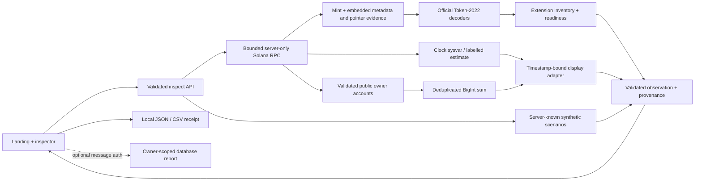

# RWA Lens

**Know what your real-world token means.** RWA Lens helps wallet builders, issuers,
fund administrators, custodians and treasury operators inspect a Solana mint,
reconcile public raw balances with displayed amounts, and understand observable
transfer controls.

[Open the app](https://rwalensonsolana.vercel.app) ·
[Inspector](https://rwalensonsolana.vercel.app/rwa) ·
[Verification evidence](docs/rwa-demo-evidence.md) ·
[Capability matrix](docs/rwa-capability-matrix.md) ·
[Two-minute demo](docs/rwa-demo-script.md)

The app reads public chain state. It does **not** sign or submit transactions,
move assets, mint, settle, lend or take custody. Optional wallet **message**
signing authenticates saved-report ownership only. Saving a report is a database
write; guest inspection and JSON/CSV export require no wallet.

## What makes it useful

A wallet balance alone does not explain a token's authorities, extension controls
or display conversion. RWA Lens puts raw units, decimals, the current display
multiplier, account states and source evidence together. Its Solana contribution
is Token-2022-aware accounting using the official decoders. Plain SPL Token is
also supported; neither program ownership nor metadata proves an asset is an RWA.

The curated live example is **Ondo USDY**, an officially attributed non-stock
Treasury-linked note on Solana. The checked-in [source manifest](lib/rwa/live-assets.json)
records the exact mint, network, issuer sources and retrieval date. USDY's observed
mint uses **legacy SPL Token**. A clearly labelled synthetic treasury receipt
separately demonstrates Token-2022 scheduled display multipliers. Issuer descriptions
are attribution, not independent verification of backing or legal rights.

## Accounting and controls

Raw amounts and supply stay as decimal strings / `BigInt`. Public accounts are
validated for program, mint and owner and deduplicated before summing. The
standard decimal amount is exact. The official Scaled UI Amount conversion is
an isolated floating-point display calculation, labelled `official-helper`;
its output is never fed back into raw accounting.

The active multiplier is selected using the observed Clock sysvar timestamp.
The mint, Clock and owner reads expose their own context slots. They are separate
reads, not an atomic snapshot. Block time or local-clock fallback is explicitly
an estimate; incomplete accounts and unsupported data remain partial or unknown.

| Extension | Explanation |
| --- | --- |
| Scaled UI Amount | Changes display conversion without changing raw units; scheduled boundaries and rounding are shown. |
| Interest Bearing | Detected; calculation unavailable. Incompatible with Scaled UI Amount. |
| Transfer Hook | An active hook requires evaluation beyond this inspector; an unset hook is inactive. Its address does not establish KYC status. |
| Default Account State | Describes newly created accounts; existing account states are checked separately. |
| Permanent Delegate | Discloses the mint-level authority that holders cannot revoke. |
| Transfer Fee Config / Amount | Shows fee configuration and withheld units separately; holding alone does not charge a fresh fee. |
| Pausable / Non-transferable | Shows observed blocking state and applicable authority. |
| CPI Guard | Explains CPI-specific restrictions without declaring every owner transfer blocked. |
| Metadata / group pointers | Shows decoded pointers and safely bounded retrieval evidence. |
| Confidential / unknown variants | Distinguishes observable public units from unobservable data; never invents an encrypted balance. |

Readiness keeps known blocks and unknown checks independently visible. It is an
explanation of inspected data, not a transaction simulation or legal authorization.

## Run locally

Use Node 22.19+ and the checked-in npm lockfile. Next.js remains 16.3.5.

```sh
npm ci
npm run dev
# http://127.0.0.1:3000 — /rwa remains a supported deep link
```

Fixtures work without any credentials. To enable live reads, copy `.env.example`
to `.env.local` and configure the server:

```dotenv
RWA_CLUSTER=mainnet-beta
RWA_RPC_URL=https://api.mainnet-beta.solana.com
```

The public RPC can rate-limit; use an operator-managed provider for sustained
traffic. A browser cannot supply an RPC URL. Only the operator's configured
network is supported and no silent network fallback occurs.

## Verify

```sh
npm run lint
npm run typecheck
npm test
npm run build
npm run test:e2e
```

Playwright launches `next start` against the production build on port 3300.
The deterministic suite uses fixtures/mocked failures and requires no secrets.
Run `npm run build` before it; never run two builds against the same `.next`.

Explicit read-only hosted verification is separate:

```sh
node scripts/verify-live.mjs
# Optional local production target:
RWA_VERIFY_BASE_URL=http://127.0.0.1:3300 node scripts/verify-live.mjs
```

This reads the official non-stock mint, a declared public owner and the synthetic
boundary examples, and writes `docs/evidence/live-observations.json`. It sends no
transaction. GitHub's `Verify RWA Lens` workflow runs deterministic checks on
pushes and pull requests. `Explicit hosted read verification` is manually invoked
and uses no wallet/provider credentials. Current measured results are in the
evidence document; historical counts are not current verification.

## Architecture



## Configuration and API

All configuration is documented in [.env.example](.env.example). RPC URLs,
session secrets and database service-role keys remain server-only. Metadata
hosts are deny-by-default. The static issuer manifest has no remote dependency;
optional remote registry and NAV adapters cannot supply invented fiat values.

| Endpoint | Behavior |
| --- | --- |
| `POST /api/rwa/inspect` | Validated live request or fixed fixture ID/scenario; same response contract. |
| `POST /api/rwa/metadata` | Explicit request, configured HTTPS allowlist, DNS/private-IP rejection, pinned connection, timeout and size caps. |
| `POST /api/rwa/auth` | Optional exact-origin wallet message authentication and sign-out; durable single-use challenge required. |
| `GET/POST /api/rwa/reports` | Optional session-owned reports; the server re-inspects instead of trusting uploaded observations. |
| `GET /api/rwa/reports/[reportId]` | Session-owner lookup; another owner's opaque ID returns 404. |

```json
{"mode":"live","cluster":"mainnet-beta","mint":"A1KLoBrKBde8Ty9qtNQUtq3C2ortoC3u7twggz7sEto6"}
```

```json
{"mode":"fixture","fixtureId":"treasury-scaled","scenario":"before"}
```

Fixture requests cannot override balances, identity, timestamps or provenance.
Malformed input returns 400; missing accounts 404; a non-mint account 422;
provider failures return structured unavailable responses with appropriate 5xx
status. Error bodies contain neither credentials nor stack traces.

## Optional reports and security boundaries

Production inspection and export are guest features. Cloud reports and wallet
sign-in remain disabled unless their complete independent database, origin,
secret and durable challenge configuration is supplied. An HMAC cookie is not a
Supabase JWT. Service-role repository access relies on tested server-enforced
ownership; it must not be described as automatic RLS identity mapping.

The existing **rwa-lens** Supabase project is independent of Lotline. Its shared
rate limiter is preserved. Read-only local fallback is bounded but is not a
cross-instance security guarantee. Authentication fails closed when durable
storage or required rate limiting is unavailable.

See [limitations](docs/rwa-limitations.md), [deployment/rollback](docs/rwa-deployment.md)
and [third-party notices](docs/third-party-notices.md). No backing, compliance,
eligibility, redemption, investment-performance or transfer-success certification
is made. The project uses the [MIT license](LICENSE).
